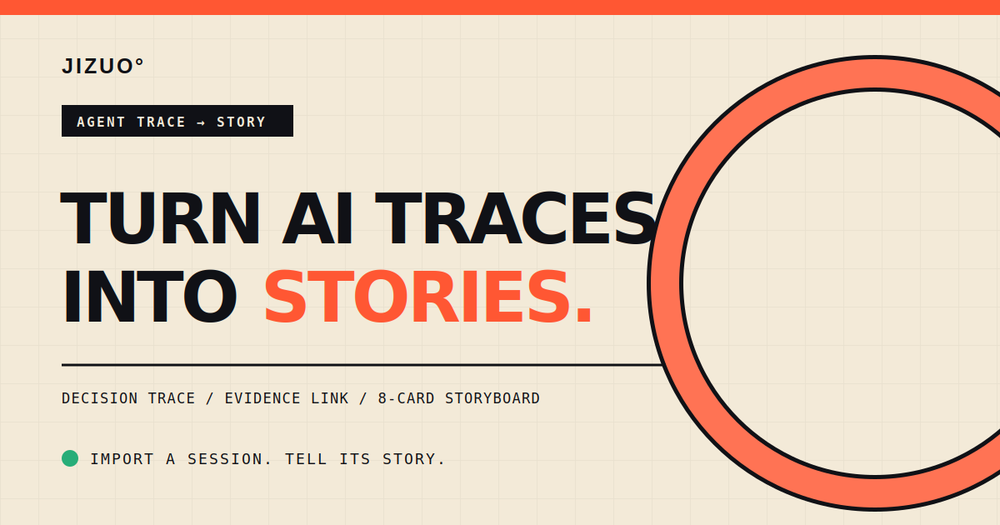
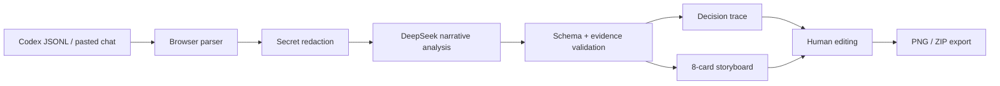

<p align="center">
  
</p>

<h1 align="center">Jizuo · 迹作</h1>

<p align="center"><strong>Turn AI traces into evidence-backed stories.</strong></p>

<p align="center">
  <a href="https://jizuo.vercel.app">Live Demo</a> ·
  <a href="./README.zh-CN.md">简体中文</a> ·
  <a href="./docs/PRODUCT.md">Product Brief</a>
</p>

Jizuo turns a real Agent session into a decision trace and an editable eight-card social story. Instead of summarizing only the final answer, it keeps the goal, failed attempts, trade-offs, tool evidence, and outcome connected.

## Why Jizuo?

AI-assisted work creates valuable material every day, but most of it disappears inside chat logs. Generic writing tools can rewrite the final answer; they cannot explain why a direction changed or prove where a claim came from.

Jizuo makes the process publishable:

- **Trace the decisions** — detect goals, attempts, friction, turns, insights, and results.
- **Keep the evidence** — every node and card links back to source events and tool output.
- **Edit the structure** — click or drag a trace node onto the current card, then rewrite in place.
- **Publish the result** — export one 3:4 PNG or all eight cards as a ZIP.
- **Stay transparent** — local redaction runs before analysis, and fallback mode is clearly labeled.

## How it works



The model never returns free-form copy directly to the UI. It must produce a validated story graph with event IDs; invalid or invented references are rejected and repaired once before a transparent local fallback is used.

## Quick start

```bash
git clone https://github.com/xiaoqi302/jizuo.git
cd jizuo
npm install
cp .env.example .env.local
npm run dev
```

Jizuo supports two server-side routes: a direct DeepSeek key, or Vercel's OIDC identity through AI Gateway after AI credits are enabled for the account. For local direct access, add a DeepSeek key to `.env.local`:

```bash
DEEPSEEK_API_KEY=your_key_here
```

For local AI Gateway access, set `AI_GATEWAY_API_KEY` instead.

Then open `http://localhost:3000`. You can also click **Try the sample trace** without a key.

## Stack

- Next.js 16, React 19, TypeScript
- DeepSeek JSON-mode chat completions
- Zod evidence and output validation
- `html-to-image` + JSZip for 3:4 exports
- Vitest for parser and story-contract tests

## Privacy model

Files are parsed in the browser first. Common API keys, authorization headers, tokens, email addresses, sensitive URL parameters, and local usernames are redacted before events are sent for analysis. Jizuo does not include a database in the MVP; the latest workspace is stored only in the current browser.

Do not upload logs you do not own or have permission to process. Review exported cards before publishing.

## Status

The MVP currently supports Codex JSONL plus JSON, Markdown, and plain conversation text. Next priorities are Claude Code / Gemini CLI adapters, reusable story templates, and fully local model support.

Built for the 2026 Xunlei Campus AI Creator Camp. Licensed under [MIT](./LICENSE).
