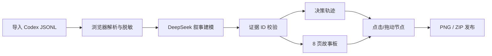

# 迹作 Jizuo · 产品说明书

> Turn AI traces into stories.  
> 把一次 AI 实操轨迹，变成有证据、可发布的自媒体作品。

- 参赛赛道：创新 AI 工具
- 作品形态：响应式 Web 应用
- AI 模型：DeepSeek（结构化 JSON 生成）
- 提交周期：2026-07-15 至 2026-08-15
- 当前状态：可运行 MVP，已通过桌面端、移动端与真实导出验收

## 1. 用户洞察

### 1.1 目标用户

迹作服务于两类高度重叠的用户：

1. 大量使用 Codex、Claude Code 等 Agent 完成真实工作的学生、开发者与独立创作者；
2. 持续输出 AI 工具测评、实操复盘和产品思考的自媒体创作者。

他们的核心任务不是“再生成一篇 AI 文案”，而是：

> 当我真的用 AI 做完一件事后，帮我快速找出最值得讲的转折，保留原始证据，并变成可直接发布的作品。

### 1.2 真实摩擦

- **素材已经产生，却散落在日志中**：Prompt、工具调用、失败信息、搜索结果和最终代码分布在一次长会话里。
- **手工复盘是第二次创作**：用户需重新回忆时序、截图、挑证据、写标题、排版，往往因成本过高而放弃。
- **普通总结压扁了故事**：现有对话总结容易只保留结论，丢失“尝试—被否定—转向—验证”的故事张力。
- **AI 内容缺少可信度**：当文案与原始事件脱节，创作者很难检查模型是在提炼，还是在补全不存在的故事。

### 1.3 洞察来源与边界

当前洞察来自参赛者的高频 Agent 使用经验、真实 Codex 日志结构分析，以及对“对话回放、操作教程、通用文案生成”等替代方案的任务对比。这是 MVP 阶段的定性洞察，不伪装成大规模统计结论。

## 2. 方案设计

### 2.1 核心闭环

### 2.2 五个关键产品动作

1. **导入**：支持 Codex JSONL，同时兼容 JSON、Markdown 和普通对话文本。
2. **解析**：在浏览器中识别用户消息、Agent 消息、工具调用、工具结果、命令、文件修改与错误。
3. **建模**：DeepSeek 将时序事件重组为目标、尝试、摩擦、决策、洞察和结果节点，同时生成 8 页叙事。
4. **人机共编**：用户点击或拖动节点绑定到当前卡片，查看原始证据，并就地修改页面标记、标题和正文。
5. **发布**：单页导出 1350×1800 PNG，或打包 8 页 ZIP，直接适配 3:4 图文内容。

### 2.3 与替代方案的区别

| 方案 | 保留原始日志 | 理解失败与取舍 | 卡片可追溯 | 直接发布 |
|---|---:|---:|---:|---:|
| 对话回放工具 | 是 | 弱 | 否 | 否 |
| 通用 AI 文案 | 否 | 弱 | 否 | 部分 |
| 屏幕操作教程 | 部分 | 否 | 步骤可追溯 | 部分 |
| **迹作** | **是** | **是** | **是** | **是** |

迹作的最小创新单元不是“又一个生成器”，而是**带原始证据的决策节点**：它既是叙事结构，又是用户可直接操纵的编辑对象。

## 3. AI 原生能力

### 3.1 不是 Prompt 套壳

如果移除 AI，迹作仍能解析和展示日志，但无法完成核心价值：在非结构化、噪声密集的长轨迹中识别真正的转折，并将同一组事件编排为有张力的八页叙事。这需要语义理解，而不是固定模板匹配。

### 3.2 结构化输入与输出

- 输入是经解析的事件数组，含 actor、kind、toolName、timestamp 和脱敏后文本，而不是一整段原始文字。
- 输出必须满足严格 Schema：4–12 个决策节点、固定 8 页卡片、质量分数与警告。
- 每个 `eventId` 必须真实存在于输入；每个 `nodeId` 必须指向真实节点。

### 3.3 约束幻觉的完整链路

1. Zod 校验模型 JSON 结构；
2. 二次检查证据与节点引用是否存在；
3. 失败时将具体校验错误反馈给模型，仅修复一次；
4. 仍不合法时使用确定性本地基础模式，并在 UI 中明确标注，不伪装成 AI 结果；
5. 最终发布权仍由用户掌握，可删除证据、重新绑定节点和改写卡片。

### 3.4 模型配置

默认调用 DeepSeek 当前 JSON Mode 能力，配置为 `deepseek-v4-flash`；服务端可通过环境变量替换模型与 Base URL。API Key 始终保留在服务端。

## 4. 技术落地与可行性

### 4.1 技术架构

- 前端：Next.js 16、React 19、TypeScript、响应式 CSS
- 日志处理：浏览器端 Codex JSONL / 文本解析器
- AI 层：Next.js Route Handler + DeepSeek Chat Completions JSON Mode
- 可靠性：Zod 输入、输出与引用校验，45 秒超时，限频和本地降级
- 导出：`html-to-image` + JSZip
- 质量：Vitest、TypeScript、ESLint、Next.js production build，桌面/移动端浏览器验收

### 4.2 为什么能快速落地

- MVP 不需要数据库、账号系统或客户端安装，打开链接即可体验。
- 计算量主要发生在一次结构化叙事分析，生成后的编辑与导出全部在浏览器完成。
- 支持内置示例和透明本地降级，即使模型短时不可用，也不会让 Demo 失效。

### 4.3 已完成的真实验收

- 9 项单元测试通过；
- TypeScript、ESLint 与 Next.js 生产构建通过；
- 示例链路实际生成 7 个节点与 8 页卡片；
- 卡片文本编辑、点击绑定证据与状态恢复通过；
- 实际导出 1350×1800 PNG 和含 8 张图的 ZIP；
- 390px 移动端无水平溢出，主要任务可完成。

## 5. 隐私、合规与安全

- **先脱敏，后分析**：API Key、Authorization Header、常见 Token、JWT、邮箱、敏感查询参数和本机用户名会被删除或替换。
- **数据最小化**：最多上传 120 个紧凑事件；MVP 无数据库，最后工作台只保存在本地浏览器。
- **使用者授权**：用户应只导入自有或已获处理授权的日志。
- **人工终审**：生成结果必须在发布前复核，迹作不自动代替用户发布。
- **内容合规**：产品不提供侵权素材抓取、身份冒充或规避平台审核能力。

## 6. 商业化思考

### 6.1 价值与付费动机

迹作节省的不是一次“写 800 字”的时间，而是从真实工作恢复叙事、挑证据和重新排版的整个二次创作成本。高频 Agent 用户与内容团队对“更快发布 + 更可信”具备明确付费动机。

### 6.2 可验证的分层方案

| 层级 | 面向人群 | 核心权益 | 假设价格 |
|---|---|---|---:|
| Free | 尝鲜用户 | 内置示例、每周 3 次分析、基础模板 | ¥0 |
| Pro | 个人创作者 | 更高频次、多模板、品牌色、无标识导出 | ¥29/月 |
| Team | 工作室/校园媒体 | 共享模板、证据审核、成员协作 | 按席位 |

价格是待验证假设，而非已发生的商业收入。

### 6.3 冷启动与增长

- 用迹作讲迹作的开发过程，形成“产品本身就是最佳案例”的传播闭环。
- 提供公开故事模板和示例轨迹，让使用者在 30 秒内看见成品。
- 从 AI 工具测试、独立开发和校园创作群体开始，用真实“轨迹→作品”案例而非功能广告获客。
- 后续模板市场可让创作者分发转化率高的叙事结构，形成供给侧增长。

### 6.4 北极星指标

**每周成功导出的有证据故事数**。辅助指标包括：导入到首次导出转化率、生成后人工修改比例、卡片证据覆盖率、七日复用率与 Pro 转化率。

## 7. 路线图

1. **MVP（已完成）**：Codex JSONL、DeepSeek 叙事、证据轨迹、8 页编辑与导出。
2. **V1.1**：Claude Code / Gemini CLI 适配器，故事模板切换，可下载的证据索引。
3. **V1.2**：多会话合并、品牌设计系统、本地模型和团队审核。
4. **V2**：将同一条证据轨迹适配为长文、短视频分镜与播客提纲，但始终保留原始出处。

## 8. 原创与作品声明

迹作的产品定义、交互结构、视觉系统、日志解析器、证据约束与导出链路均为本次参赛实现。开源依赖均通过正常包管理方式引入并保留原许可证。内置 Demo 日志为专门编写的合成样例，不包含他人隐私会话。

## 9. 一句话总结

**迹作不替用户编一个故事，它把用户已经做过的 AI 工作，变成一个可验证、可编辑、可发布的故事。**
